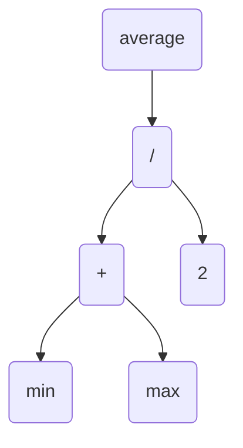
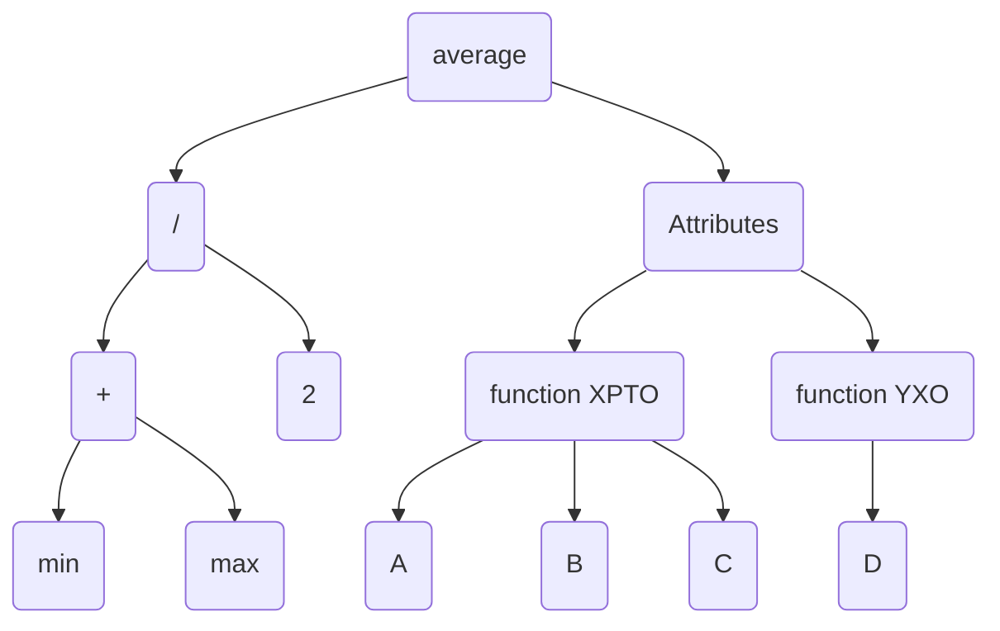

# The Parts of a Language
In the authors perspective we have some steps to do while the compiler (or transpiler) executes its action:

### Scanning
In this phase we are going to analize the current line (we define a line by some special chars, such as _{_, _}_, _;_ etc).

### Parsing
In this phase we're going to translate what we got to build a **Abstract syntax tree**. In the end we'll have a code look like this:

> var average = (min + max) / 2;

This struct help us undestand **syntax erros**

### Static analysis
Now we need to undestand thing like a + b, we know bc of the parsing phase that this means add A to B, but the question is: What is A? What is B?

To answer those questions we must do something called **binding** (or **resolution**). Basically the compiler ties together the variable and its current value. As a following action we now know the variable scope (thats because we know that some variable is storage in some space).

Think in scope like this: We have a mini-world that has A B C variables. If we see this world and didnt find D var this means that D is not in our world.

Now that we have variables control to **where** they are we can also check its type, this is useful for cases that we're trying to add 2 variables but they are from different types. If we check that the types are diff we can raise a **type error**

The way we store this variable information is something like this (my interpretation of the book)

### Intermediate representations
Everything we see so far is considered the "front end" of the application, now we're going to see a little more about the "back end" part. But before this is important to know about IR (Intermediate representations).

Imagine the following scenario:
You write 3 programs, each one using one different language. When we'll compile our program we must write a compiler for each of the languages, right? This is write but we can do better, imagine this:

Javascript -> Compiles to C
C# -> Compiles to C
Python -> Compiles to C

As we define every language will be "precompiled" to another common language, this guarantees to us that each of then will have support for the same "master compiler" and now we only need to write e compiler to C programs. This is called **Inermediate representations**

### Optimization
One good example is the GCC compiler that checks if its possible to get the result of some expression and calculates it at compile time, like so:

pennyArea = 3.14159 * (0.75 / 2) * (0.75 / 2);

Converts to:

pennyArea = 0.4417860938;

This will help us a little bit with program efficience. In a major scale this can help us save a lot of time and money

### Code generation
In this step we'll create code to computer executes, its like the assembly part. Now we have a choice to do: Should we generate code to one specific CPU? Or should we create code to a virtual machine?

As everything in CS we have cons and pros, the pro in generate to one specific CPU is that it will be extremeally fast, and con is that it will only work for 1 CPU (nothing more, everytime we have to run the code in another machine we should compile it again). The pro in virtual machine is that it is portable, every device that have this VM can run the code (like Java), the con is that is slower.

### Virtual machines
Even if you chose for a language that is based on language VMs you should do some extra steps to achieve a working language. If your code produces bytecode you should create a mini-compiler to understand this bytecode and convert it to assembly, this is a similar idea to _Intermediate representations_ but its easier bc you already know that every bytecode is the same, you must only change your assembly based on system.

Another idea is create a language VM that runs over a hypothetical chip, this is even slower than the VM way but offers you much less work to create something

### Runtime
At least we have the runtime phase, this is simple, if you generate assembly just load it in the system and its done. If you generate bytecode you should start your VM to manage the program. Things like gargabe collector, instance of tests, etc are dealing in **runtime** phase

# Alternative routes

### Transpilers
In beggining everything transpilers to C as C was well spread by UNIX.

_Web browsers are the “machines” of today, and their “machine code” is JavaScript, so these days it seems almost every language out there has a compiler that targets JS since that’s the main way to get your code running in a browser._

# Compilers and Interpreters
Compilers and interpreters has the same correlation as vegatables and fruits. One dont necessarily discarts the other, we have foods that can fit both sides (this is an author example, i totally disagree that tomato is a vegetable)

**Compiling**: Translate the current code to another language that will be executed. (It does not execute code, only translate)

**Interpreting**: Read the code and execute as it runs

CHALLENGES
1. Pick an open source implementation of a language you like. Download the source code and poke around in it. Try to find the code that implements the scanner and parser. Are they hand-written, or generated using tools like Lex and Yacc? ( .l or .y files usually imply the latter.)

Scanner + parser _deps/icu-small/source/common/rbbiscan.cpp_

2. Just-in-time compilation tends to be the fastest way to implement a dynamically-typed language, but not all of them use it. What reasons are there to not JIT?

Jit its a better choice if your software has a long lifetime, if it isnt the case you should opt for compile native code. This occurs because JIT request an extra step that is translate your code to a default language and then compile it to machine code. (Source)[https://stackoverflow.com/questions/13689435/why-not-jitjust-in-time-compilers-everywhere]

Companies like apple do not allow use JIT for a security reason, when you allow translate your code during runtime this can generate potencial security risks (Souce)[https://www.reddit.com/r/EmulationOniOS/comments/1d8yhh9/why_no_jit/]

3. Most Lisp implementations that compile to C also contain an interpreter that lets them execute Lisp code on the fly as well. Why?

There's two main reasons:
- Fallback if your machine does not have support for lisp compiler
- Help in debug (instead you compile your entire application to test something you only runs it inside interpreter)